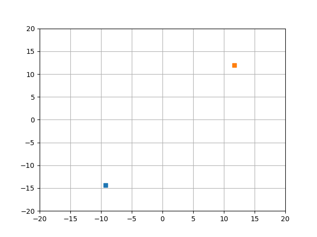
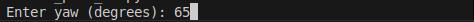

# # Automatic Trajectory Calculation and Visualization

This project calculates and visualizes the optimal trajectory between two points using the Reep-Sheep algorithm. The user inputs the start point, end point, and orientation (yaw) to generate the trajectory.

## Features

- User can select start and end points by clicking on the plot.
- User can input the yaw (orientation) at both the start and end points.
- The trajectory is calculated and visualized using rsplan, Matplotlib.
- Animated visualization of the trajectory.

## Installation

1. Clone the repository:
    ```sh
    git clone https://github.com/Cyber-Mrt/automaticPath.git
    cd automaticPath
    ```

2. Install the required Python packages:
    ```sh
    pip install -r requirements.txt
    ```

## Usage

1. Run the script:
    ```sh
    python automatic_path.py
    ```

2. Click on the plot to select the start and end points.
3. Enter the yaw (orientation) in degrees when prompted.
4. The calculated trajectory will be visualized and animated on the plot.

## Example







## Contributing

Contributions are welcome! Please fork the repository and create a pull request with your changes.

## License

This project is licensed under the MIT License. See the [LICENSE](LICENSE) file for details.
